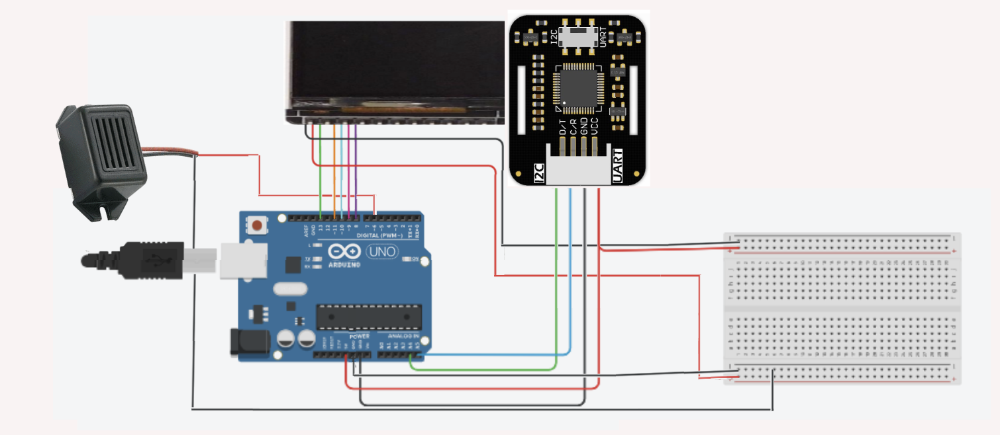

# Medical Telemonitoring System Using Arduino Uno

**Authors:** Sara El Bari, Niamatellah Lahkim, Morgane Carbillet  
**University:** University of Western Brittany  
**Academic Year:** 2023 – 2024  

---

## Overview
This project presents a **medical remote-monitoring system** that continuously tracks and transmits a patient’s vital signs using an **Arduino Uno**.  
It measures **temperature**, **heart rate**, and **oxygen saturation (SpO₂)**, displays them locally on a **TFT LCD**, and sends the data online through an **Ethernet Shield** to a **ThingSpeak** dashboard for real-time analysis.

---

## Physical Overview

Below is an image showing the **physical prototype (boîte)** of the telemonitoring system, including the Arduino Uno, Ethernet Shield, MAX30102 sensor, TFT display, and buzzer.

---

## ⚙️ Hardware Components

| Component | Description |
|------------|-------------|
| **Arduino Uno** | ATmega328-based microcontroller |
| **Ethernet Shield** | Provides Internet connection via SPI |
| **MAX30102 Sensor** | Measures heart rate, SpO₂, and body temperature |
| **TFT LCD 1.8″** | Color display for local monitoring |
| **Buzzer** | Audible alarm for abnormal values |
| **Breadboard + Jumper Wires** | Circuit connections and prototyping |

**Estimated Total Cost:** ≈ 79.6 €

---

## System Features

- Continuous acquisition of vital-sign data  
- Visual display on LCD and in serial monitor  
- **Automatic alarms** when:
  - SpO₂ < 90 %
  - Heart Rate < 60 bpm or > 120 bpm
  - Temperature < 30 °C or > 35 °C  
- Internet-enabled data upload to **ThingSpeak** for remote monitoring and chart visualization

---

## Wiring Diagram

The diagram below shows how each component is connected to the Arduino Uno and Ethernet Shield.

---

## Network & Cloud Setup

- **Ethernet Shield** handles connection to the Internet.  
- **ThingSpeak** channel stores and displays values:  
  - *Field 1* → Heart Rate  
  - *Field 2* → SpO₂  
  - *Field 3* → Temperature  

---

## Software Logic (conceptual)

1. Initialize libraries:  
   `Wire.h`, `SPI.h`, `Ethernet.h`, `MAX30105.h`, `heartRate.h`, `Adafruit_GFX.h`, `Adafruit_ST7735.h`
2. Configure Ethernet parameters and ThingSpeak API key.  
3. Read data from the **MAX30102** sensor.  
4. Display values on the **TFT LCD** and serial monitor.  
5. Trigger the **buzzer** for out-of-range values.  
6. Transmit data to ThingSpeak at regular intervals.

---

## Future Work

- Optimize the Arduino code for memory efficiency.  
- Integrate a Wi-Fi module (ESP32) for wireless data upload.  
- Add an LCD menu for patient ID and calibration.  
- Explore ML-based anomaly detection on ThingSpeak.

---

## License
This project was developed in 2023–2024 at the **University of Western Brittany**  
by **Sara El Bari**, **Niamatellah Lahkim**, and **Morgane Carbillet**.  
Licensed under the [MIT License](LICENSE).

